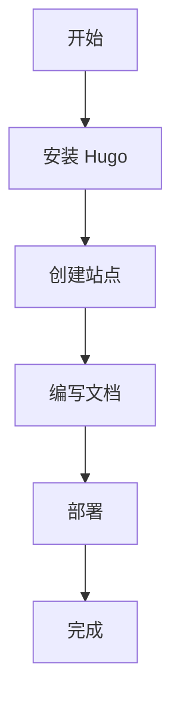

+++
date = '2026-03-02T14:06:32+08:00'
draft = false
title = 'Hugo 完整文档教程'
slug = 'hugo-docs-tutorial'  # 添加这一行
description = '完整教程：使用 Hugo 构建专业文档站点的详细指南'
author = 'breeze'
tags = ['hugo', '文档', '教程', '静态网站']
categories = ['技术教程']
+++

根据您提供的前置元数据（Front Matter）结构，您希望我为您撰写一篇关于“Hugo编写文档教程”的教程文章内容。我将按照Hugo博客的标准格式，为您完成文章的主体内容。

Hugo 完整文档教程：从零开始构建专业技术文档站点

在现代技术开发中，清晰、规范的文档是项目成功的关键因素。Hugo 作为一个快速、现代的静态网站生成器，凭借其简洁的设计和强大的功能，成为了许多开发者首选的文档工具。本文将为您提供一份完整的 Hugo 文档编写教程。

为什么选择 Hugo 编写文档？

Hugo 的主要优势

• 极快的构建速度：Hugo 是目前构建速度最快的静态网站生成器之一

• 无需数据库依赖：纯静态站点，易于部署和维护

• Markdown 友好：使用简单的 Markdown 语法编写内容

• 主题生态系统丰富：拥有大量专门为文档设计的主题

• 多语言支持完善：内置国际化和多语言功能

一、Hugo 文档站点基础设置

1.1 安装 Hugo

根据您的操作系统选择相应的安装方式：
# macOS (使用 Homebrew)
brew install hugo

# Ubuntu/Debian
sudo apt install hugo

# Windows (使用 Chocolatey)
choco install hugo


1.2 创建新站点

# 创建名为 "mydocs" 的新站点
hugo new site mydocs
cd mydocs

# 初始化 Git 仓库
git init


1.3 选择合适的文档主题

Hugo 有许多优秀的文档主题，以下是几个推荐：

1. Docsy - 谷歌风格的文档主题
2. Hugo Learn - 专门为文档设计
3. Hugo Book - 适合创建在线书籍
4. Geekdoc - 简洁现代的文档主题

以 Docsy 为例：
# 将 Docsy 添加为子模块
git submodule add https://github.com/google/docsy.git themes/docsy
git submodule update --init --recursive


二、文档内容组织策略

2.1 合理的目录结构


content/
├── docs/                    # 文档主目录
│   ├── _index.md           # 文档首页
│   ├── getting-started/    # 入门指南
│   │   ├── _index.md
│   │   ├── installation.md
│   │   └── configuration.md
│   ├── guides/             # 使用指南
│   ├── api/                # API 文档
│   ├── faq/                # 常见问题
│   └── changelog.md        # 更新日志
├── blog/                   # 博客文章
└── about.md                # 关于页面


2.2 使用章节组织文档

Hugo 的章节功能可以帮助您更好地组织文档结构：
# 在 _index.md 中定义章节权重
weight: 10
title: "入门指南"


三、Hugo 文档编写最佳实践

3.1 标准的前置元数据

每个文档文件都应该包含完整的前置元数据，如您提供的示例：
+++
title = "安装指南"
description = "详细介绍如何安装和配置本系统"
date = 2026-03-02T14:06:32+08:00
draft = false
weight = 10
tags = ["installation", "setup", "getting-started"]
categories = ["入门指南"]
+++


3.2 使用短代码增强文档

Hugo 的短代码功能可以让您的文档更加丰富：

3.2.1 警告和提示框

```markdown
这是一个包含短代码的示例：


这是一条警告信息

```


3.2.2 代码块增强

```markdown


bash
hugo new site mydocs



powershell
hugo new site mydocs




```

3.3 添加搜索功能

# config.toml
[params]
  [params.search]
    enable = true
    type = "lunr"  # 或 "algolia"
    
  [params.search.lunr]
    maxResults = 20
    snippetLength = 30


四、高级文档功能

4.1 多版本文档管理

对于需要维护多个版本的文档：
# 创建版本化的内容结构
content/
├── docs/
│   ├── v1.0/
│   ├── v2.0/
│   └── latest/ -> v2.0/


4.2 API 文档自动生成

使用 Swagger/OpenAPI 规范自动生成 API 文档：
# 在 static/api/ 目录下放置 OpenAPI 规范文件
# 然后通过主题的 API 文档功能展示


4.3 集成文档搜索

使用 Algolia 提供全文搜索：
[params.algolia]
  appId = "YOUR_APP_ID"
  apiKey = "YOUR_API_KEY"
  indexName = "YOUR_INDEX_NAME"


五、文档样式和用户体验优化

5.1 响应式设计

确保您的文档主题支持：
• 移动设备友好

• 代码块的横向滚动

• 表格的响应式显示

5.2 可访问性优化

<!-- 确保所有图片都有 alt 文本 -->


<!-- 使用语义化的标题结构 -->
# 主标题
## 二级标题
### 三级标题


5.3 性能优化

# 在 config.toml 中启用性能优化
[build]
  writeStats = true
  useResourceCacheWhen = "fallback"

[imaging]
  quality = 85
  resampleFilter = "CatmullRom"


六、部署和持续集成

6.1 GitHub Pages 部署

# .github/workflows/gh-pages.yml
```yaml
name: Deploy to GitHub Pages

on:
  push:
    branches: [ main ]

jobs:
  deploy:
    runs-on: ubuntu-latest
    steps:
      - uses: actions/checkout@v3
        with:
          submodules: recursive
      
      - name: Setup Hugo
        uses: peaceiris/actions-hugo@v2
        with:
          hugo-version: 'latest'
          
      - name: Build
        run: hugo --minify
        
      - name: Deploy
        uses: peaceiris/actions-gh-pages@v3
        with:
          github_token: ${{ secrets.GITHUB_TOKEN }}
          publish_dir: ./public
```

6.2 Netlify 部署

# netlify.toml
```toml
[build]
  publish = "public"
  command = "hugo --gc --minify"

[build.environment]
  HUGO_VERSION = "0.146.0"

[context.production.environment]
  HUGO_ENV = "production"
```

七、文档维护和质量保证

7.1 链接检查自动化

# 使用 htmltest 检查链接
npm install -g htmltest
htmltest


7.2 拼写检查

# 使用 cSpell
npm install -g cspell
cspell "content/**/*.md"


7.3 文档版本控制策略

```
CHANGELOG.md
├── 2026-03-02 - 版本 2.0.0
│   ├── 新增功能
│   ├── 问题修复
│   └── 已知问题
└── 2025-12-15 - 版本 1.2.0
```

八、高级技巧和工具

8.1 使用 Asciinema 嵌入终端演示
```

```

8.2 数学公式支持
```
[params.math]
  enable = true
  katex = true

$$
E = mc^2
$$
```

8.3 图表绘制

使用 Mermaid 绘制流程图、时序图等：



九、实际示例：完整的 config.toml 配置
```toml
baseURL = "https://docs.example.com/"
languageCode = "zh-cn"
title = "项目文档"
theme = "docsy"

[params]
  description = "项目完整文档，包含安装、使用、API 参考等"
  author = "项目团队"
  
  [params.ui]
    [params.ui.sidebar]
      width = ["300px", "25%"]
    
  [params.search]
    enable = true
    type = "lunr"
    
  [params.toc]
    depth = 3
    numbered = true

[markup]
  [markup.highlight]
    codeFences = true
    guessSyntax = true
    lineNos = true
    style = "monokai"
```

十、总结

通过本教程，您应该已经掌握了使用 Hugo 创建专业文档站点的完整流程。以下是关键要点回顾：

1. 选择合适的主题 - 根据文档类型选择专门的文档主题
2. 合理组织内容结构 - 建立清晰的目录层级
3. 充分利用前置元数据 - 提供完整的文档元信息
4. 增强用户体验 - 通过搜索、导航等功能提升可用性
5. 自动化部署流程 - 建立持续集成和部署管道
6. 确保文档质量 - 通过工具检查链接、拼写等问题

Hugo 的强大之处在于其灵活性和可扩展性，您可以根据项目需求调整和扩展这些配置。随着文档的不断丰富，您会发现 Hugo 能够轻松应对各种复杂的文档需求。

文档未详述但重要的补充：在实际项目中，建议建立文档贡献指南（CONTRIBUTING.md），明确文档编写规范、审核流程和发布流程，这对于团队协作的大型项目尤为重要。
